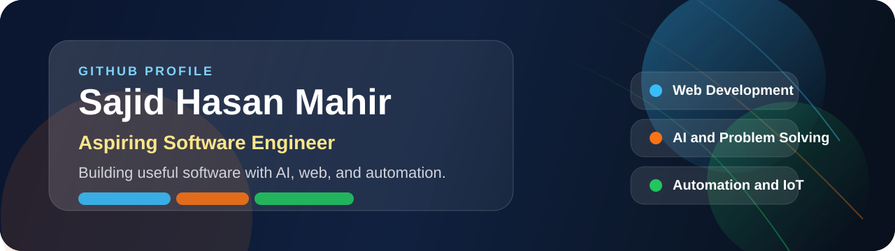

# 
Sajid Hasan Mahir

  

  
  
  

  

## Summary

I am a final-year Computer Science and Engineering student from Dhaka, Bangladesh who enjoys building practical software and intelligent systems. I am looking for opportunities where I can grow as a software engineer and contribute with strong problem-solving, clean development practices, and curiosity for modern technologies.

## Contact

- Email: [sajidhasanmahir2003@gmail.com](mailto:sajidhasanmahir2003@gmail.com)
- Phone: `01731849660`
- Location: Dhaka, Bangladesh
- GitHub: [github.com/mahir2310](https://github.com/mahir2310)
- LinkedIn: [linkedin.com/in/sajid-hasan-mahir-802437259](https://www.linkedin.com/in/sajid-hasan-mahir-802437259/)
- Portfolio: [mahir2310.github.io/MahirPortfoliyoNew](https://mahir2310.github.io/MahirPortfoliyoNew/)
- Facebook: [facebook.com/sajidhasanmahir](https://www.facebook.com/sajidhasanmahir/)

## What I Work With

- Full-stack web development
- AI and modern software technologies
- Automation and IoT-based systems
- Real-world project building and continuous learning

## Technical Skills

- Languages: HTML, CSS, JavaScript, Python, C++, Kotlin, Java
- Technologies and Frameworks: React.js, Next.js, Node.js, REST API, Postman, JWT
- Databases: PostgreSQL, MySQL, Firebase
- Tools: Git, GitHub, VS Code, Android Studio, LaTeX

  

## Connect With Me

  
  
  
  

## GitHub Analytics

  
  

  

  

